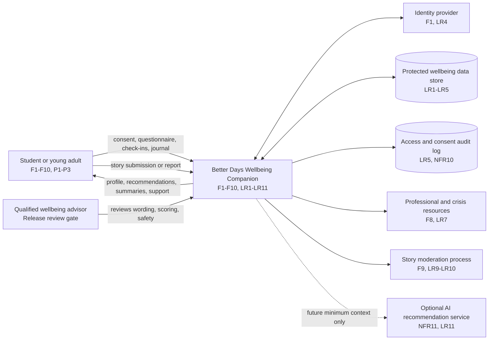

# Diagram 1 of 4 - Context

Better Days is shown as one system boundary. External services are limited to
identity, protected storage, support resources, and future optional AI.

## Boundary notes

- Private journals and check-ins stay inside Better Days and the protected store
  (F5, F7, LR2-LR4).
- Safety resources are presented separately from scoring (F8, LR7).
- AI is optional future work and cannot diagnose, assess crisis risk, or make
  autonomous safety decisions (LR11).
- Moderation is an operational boundary for stories; private journals are not
  visible to it unless deliberately submitted (F9, LR9-LR10).
