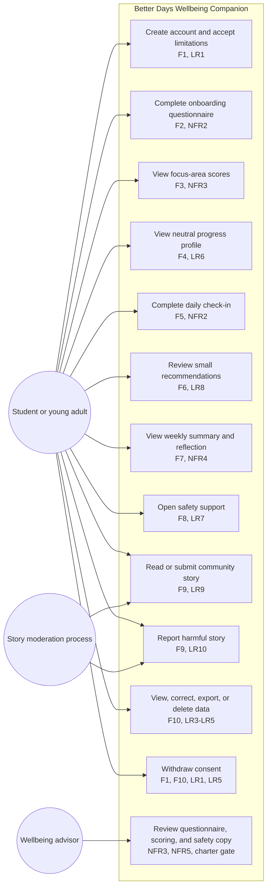

# Diagram 2 of 4 - Use Case

Each use case maps to a Better Days requirement, privacy rule, safety rule, or
charter release gate.

## Use-case notes

- UC3 and UC4 are descriptive reflections, never diagnosis (F3, F4, LR6).
- UC8 is separate from the weighted score and does not determine safety (F8,
  LR7).
- UC9 requires moderation before publication and UC10 provides reporting (F9,
  LR9-LR10).
- UC11 and UC12 are controlled data-rights operations (F10, LR1-LR5).
