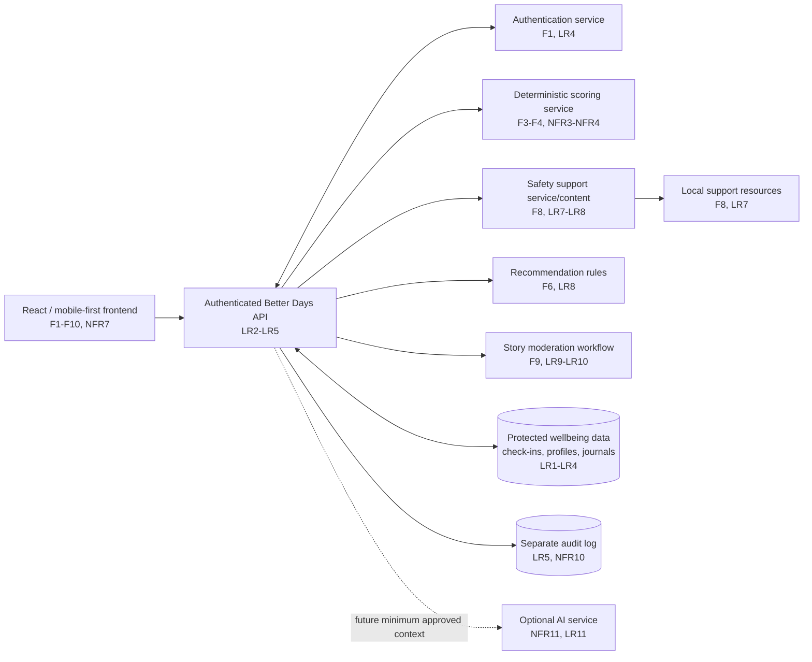

# Diagram 3 of 4 - Architecture

## Component responsibilities

- **Frontend:** collects input and displays results; it never makes clinical or
  safety decisions.
- **API:** authenticates requests, enforces ownership, and controls data rights.
- **Scoring service:** applies documented deterministic focus-area and profile
  rules (F3, F4, NFR3, NFR4).
- **Recommendation rules:** returns small non-clinical actions (F6, LR8).
- **Safety service:** shows support information separately from scoring (F8,
  LR7).
- **Moderation workflow:** keeps stories private until review (F9, LR9-LR10).
- **Audit log:** records consent, access, export, correction, moderation, and
  deletion actions (LR5, NFR10).

## Explicit trade-off

The project uses a **separate deterministic scoring service and protected data
store** instead of putting scoring directly in the frontend. This adds API and
test setup, but it makes scoring consistent across devices, keeps sensitive
rules out of the browser, and makes safety behavior easier to audit (F3, LR1,
LR5, NFR3).
