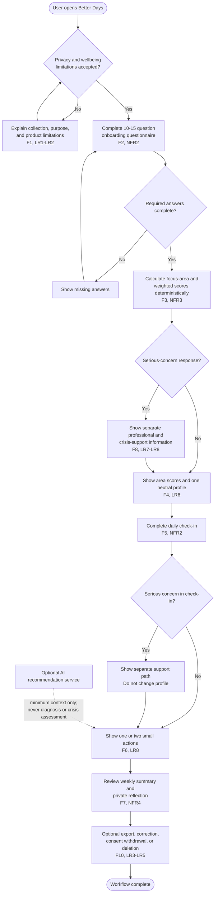

# Diagram 4 of 4 - Activity

The core flow separates wellbeing reflection from safety support. Serious-concern
answers are never reduced to the weighted score.

## Decision-point notes

- Consent must be recorded before sensitive wellbeing processing (F1, LR1).
- Missing answers cannot produce a misleading profile (F2, NFR3).
- Safety support is independent from the weighted score (F8, LR7, NFR5).
- Recommendations remain practical and non-clinical (F6, LR8).
- Data rights remain available after normal use (F10, LR3-LR5).
- Optional AI is not part of the first MVP and cannot make safety decisions
  (LR11, NFR11).
